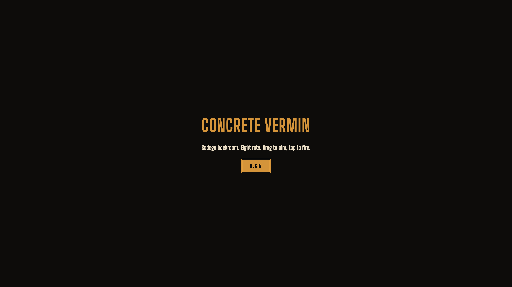

# Concrete Vermin: Tactical Reforged

Pulpy 1979 NYC rail-shooter. Drag to aim, tap to fire. Hunt rats, roaches, pigeons, geese, and worse across subway tunnels, brick alleys, sodium-vapor streets, and rooftops. Built mobile-first via Capacitor; runs in any modern browser.

> The neon POC at `poc.html` is the **floor**. Production is the ceiling.



## Status

**v1.0 shipped.** All 12 missions, Yuka governor, per-weapon charge-shot, full e2e + coverage gates. See [`docs/STATE.md`](docs/STATE.md) for the complete v1.0 snapshot.

[](https://github.com/arcade-cabinet/concrete-vermin/actions/workflows/ci.yml)

- 🟢 **Play:** [`https://arcade-cabinet.github.io/concrete-vermin/`](https://arcade-cabinet.github.io/concrete-vermin/)
- 🟢 **Tests:** 637+ node / 54+ dom / 5 e2e specs — all required gates, no `continue-on-error`
- 🟢 **Balance:** hard gate — `pnpm analysis:benchmark --profile ci` on every PR
- 🟢 **Coverage:** ≥85% lines across sim/ecs/runtime/audio
- 🟢 **Mobile:** Android via Capacitor — portrait lock, branded splash, orientation-aware HUD

## Quick start

Requires Node 22+ and pnpm 10.

```bash
pnpm install
pnpm dev          # http://localhost:5173
```

That's the entire developer setup. The rest is convention:

```bash
pnpm test         # node + jsdom (fast; the loop you'll run on every change)
pnpm typecheck
pnpm lint         # biome — not eslint, not prettier
pnpm format       # biome format --write .
pnpm build        # tsc -b && vite build
pnpm preview      # serve the built bundle locally
```

### Less-frequent commands

```bash
pnpm test:browser           # real Chromium for canvas/Pixi smoke (CI-only by default)
pnpm test:e2e               # Playwright e2e (requires browsers installed)
pnpm screenshots            # regenerate docs/screenshots/ at the 5 canonical viewports
pnpm lore:print             # reassemble JSON lore tree into prose for editorial review
pnpm analysis:smoke         # 5 runs/mission abstract benchmark (never fails)
pnpm analysis:benchmark     # 25 runs/mission, fails if median clear < 40%
pnpm analysis:lock:quick    # STABLE/UNSTABLE/UNMEASURED per mission
pnpm cap:sync               # build + sync to Capacitor (mobile)
pnpm cap:run:android        # launch on a connected Android device or emulator
```

## Stack

PixiJS · @pixi/react · Koota (ECS) · Yuka (governor + GOAP) · Tone.js · Capacitor · Radix UI · TypeScript · Vite · Vitest · Playwright · Biome · pnpm.

## Architecture in one sentence

**`src/sim/`** is pure TypeScript that knows nothing about React or Pixi; **`src/ecs/`** lifts sim primitives into Koota traits + systems; **`src/runtime/`** ticks the simulation; **`src/render/`** reads Koota and draws to a Pixi canvas; **`src/ui/`** is React shell + HUD; **`src/audio/`** is Tone.js; **`src/platform/`** wraps Capacitor; **`src/theme/`** is the brand source of truth shared by `ui/` and `render/`. See [`docs/ARCHITECTURE.md`](docs/ARCHITECTURE.md) for the actual file tree + layer rules.

## Contributing

1. **Read [`CLAUDE.md`](CLAUDE.md)** — the agent / human entry point. It names every gate.
2. **Read [`STANDARDS.md`](STANDARDS.md)** — the CI-enforced rules (sim-purity, brand palette, factory pyramid, layering, pnpm-only, no `--no-verify`).
3. **Pick an item from [`docs/STATE.md`](docs/STATE.md) "Outstanding follow-ups for v2+"** or open an issue first.
4. **Branch, PR, squash-merge.** Conventional Commits required (`feat:`, `fix:`, `chore:`, `docs:`, `refactor:`, `perf:`, `test:`, `ci:`, `build:`).
5. **All CI must be green** — never `--admin` merge, never bypass hooks.

The full operating protocol lives in [`AGENTS.md`](AGENTS.md).

## Visual regression — five canonical viewports

Regenerate with `pnpm screenshots` after any visible UI change; commit the diffs.

| Viewport | Use case |
|---|---|
| `phone-portrait-320x568` | iPhone SE / smallest Android — the lower bound for the responsive HUD column-stack |
| `phone-portrait-375x812` | iPhone 13/14/15 — typical thumbprint |
| `tablet-portrait-768x1024` | iPad — the lower bound for the desktop-style HUD row |
| `desktop-720p-1280x720` | Standard laptop |
| `desktop-1080p-1920x1080` | Standard desktop / "ship-shot" hero |

## Key documents

| Doc | What |
|---|---|
| [`CLAUDE.md`](CLAUDE.md) | Agent + human entry point |
| [`AGENTS.md`](AGENTS.md) | Operating protocols |
| [`STANDARDS.md`](STANDARDS.md) | CI-enforced gates |
| [`docs/STATE.md`](docs/STATE.md) | Current state, decisions log, follow-ups |
| [`docs/ARCHITECTURE.md`](docs/ARCHITECTURE.md) | Layer diagram + file tree + data flow |
| [`docs/DESIGN.md`](docs/DESIGN.md) | Brand bible (palette, type, voice) |
| [`docs/LORE.md`](docs/LORE.md) | Editorial style guide; data lives in `src/sim/content/lore/` |
| [`docs/AUDIO.md`](docs/AUDIO.md) | Per-weapon, per-vermin, per-act sonic direction |
| [`docs/BESTIARY.md`](docs/BESTIARY.md) | 12 archetypes |
| [`docs/WEAPONS.md`](docs/WEAPONS.md) | 6 weapons |
| [`docs/MODS.md`](docs/MODS.md) | 20 mods |
| [`docs/BALANCE.md`](docs/BALANCE.md) | Per-mission par tables |
| [`docs/TESTING.md`](docs/TESTING.md) | Three-config strategy + CI jobs |
| [`docs/DEPLOYMENT.md`](docs/DEPLOYMENT.md) | GitHub secrets + release pipeline |
| [`docs/superpowers/specs/2026-04-27-concrete-vermin-design.md`](docs/superpowers/specs/2026-04-27-concrete-vermin-design.md) | Canonical design spec |

## License

[MIT](LICENSE).
